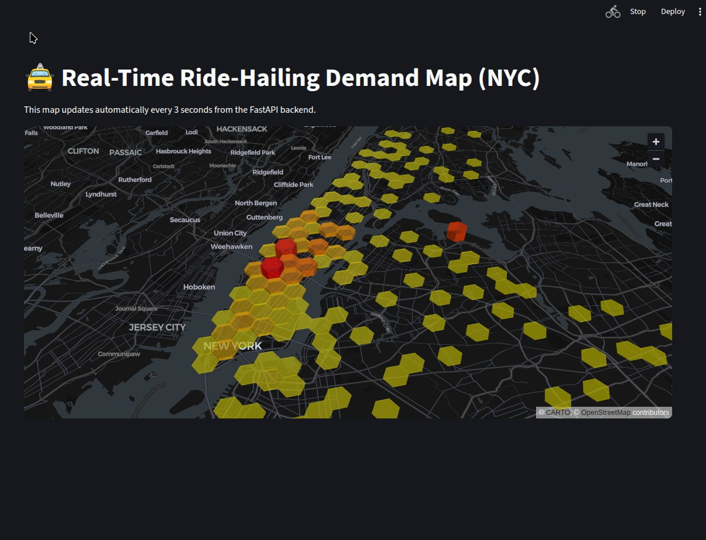
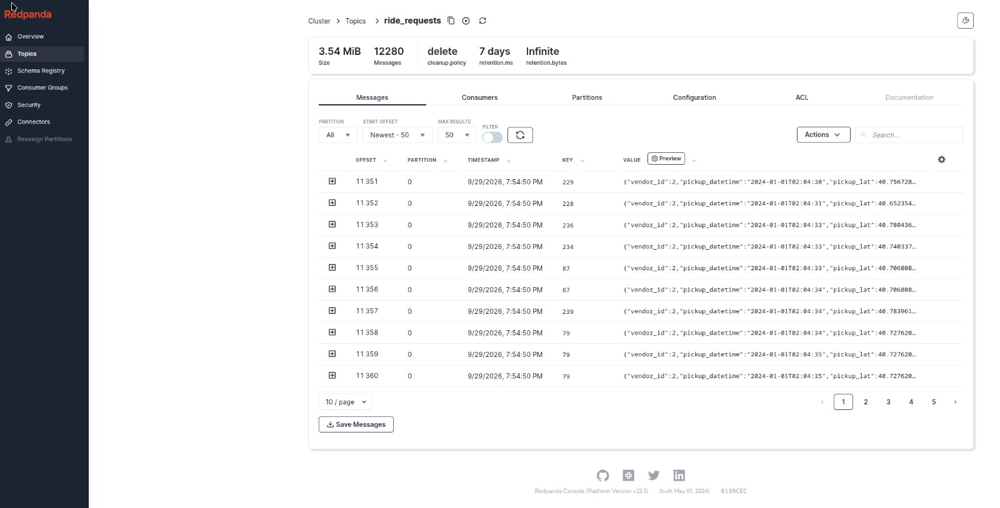

# Real-Time Ride-Hailing Demand Pipeline — Lambda Architecture

A complete end-to-end real-time stream processing pipeline that simulates a ride-hailing backend similar to Grab or Gojek.

The system processes raw GPS ride requests, computes **Uber H3 geospatial indices**, performs real-time demand aggregation, and simultaneously writes enriched event data to an **S3-compatible Data Lake** for historical analytics.

---

## 🏗️ Architecture Overview

This project implements a **Lambda Architecture** consisting of a real-time **Hot Path** and a historical **Cold Path**.

```text
                    ┌─────────────────────┐
                    │  NYC TLC Parquet    │
                    │   Historical Data   │
                    └──────────┬──────────┘
                               │
                               ▼
                    ┌─────────────────────┐
                    │  Python Producer    │
                    │  Chronological      │
                    │  Event Replay       │
                    └──────────┬──────────┘
                               │
                               ▼
                    ┌─────────────────────┐
                    │     Redpanda        │
                    │   Kafka-Compatible  │
                    │       Broker        │
                    └──────────┬──────────┘
                               │
                               ▼
                 ┌─────────────────────────────┐
                 │ Apache Spark Structured     │
                 │ Streaming                   │
                 │                             │
                 │ • Event-time processing     │
                 │ • Watermarking              │
                 │ • H3 resolution 8           │
                 │ • 5-minute tumbling windows │
                 └─────────────┬───────────────┘
                               │
                 ┌─────────────┴─────────────┐
                 │                           │
                 ▼                           ▼
        ┌─────────────────┐         ┌──────────────────┐
        │    Hot Path     │         │    Cold Path     │
        │                 │         │                  │
        │ Redis           │         │ LocalStack S3    │
        │ FastAPI         │         │ Parquet Data Lake│
        │ Streamlit       │         │                  │
        │ PyDeck          │         │ Historical Data  │
        └────────┬────────┘         └──────────────────┘
                 │
                 ▼
        ┌─────────────────┐
        │ Live 3D NYC Map │
        │   Dashboard     │
        └─────────────────┘
```

### 1. Ingestion

A Python producer replays historical **NYC TLC Yellow Taxi** Parquet data as a live chronological stream.

Each ride request is converted into a JSON event and published to **Redpanda**, a Kafka-compatible streaming platform.

### 2. Stream Processing

**Apache Spark Structured Streaming** consumes the raw JSON events and performs real-time processing:

* Parses incoming ride events
* Processes data using event time
* Calculates **H3 hexagonal spatial indices**
* Uses **H3 resolution 8** for geospatial aggregation
* Computes **5-minute tumbling windows**
* Uses event-time watermarking to handle late-arriving events

### 3. Hot Path — Serving Layer

Real-time demand metrics are aggregated and stored in **Redis** with a **10-minute TTL**.

A **FastAPI** backend exposes the latest demand data through an API, which is consumed by the Streamlit dashboard.

The frontend uses **PyDeck** to render a live 3D map and automatically refreshes every 3 seconds.

### 4. Cold Path — Data Lake

At the same time, Spark writes the enriched, unaggregated event stream as partitioned **Parquet** files into an S3-compatible **LocalStack** bucket.

This provides a persistent historical dataset that can later be used for:

* Batch analytics
* Historical demand analysis
* Model training
* Data exploration
* Business intelligence

---

# 🛠️ Tech Stack

| Component        | Technology                              |
| ---------------- | --------------------------------------- |
| Language         | Python 3.11                             |
| Streaming Engine | Apache Spark Structured Streaming 3.5.1 |
| Message Broker   | Redpanda                                |
| Serving Layer    | Redis + FastAPI                         |
| Frontend         | Streamlit + PyDeck                      |
| Data Lake        | LocalStack / S3                         |
| Geospatial       | Uber H3 + GeoPandas                     |
| Data Format      | JSON + Parquet                          |
| Infrastructure   | Docker Compose                          |
| Java Runtime     | OpenJDK 17                              |

---

# 📸 Project Demo

## Live Streamlit Map



The Streamlit dashboard displays NYC ride demand in real time.

The map automatically refreshes every **3 seconds** and uses H3 hexagonal zones to visualize areas with increasing passenger demand.

Higher demand areas are represented as demand spikes on the 3D map.

---

## Redpanda Kafka Stream



Redpanda receives the raw ride-hailing events produced by the Python simulator.

The producer replays historical NYC TLC data as a continuous, paced JSON stream to simulate real-time ride-hailing traffic.

---

# 🚀 Quickstart

## Prerequisites

Make sure the following are installed:

* Docker
* Docker Compose
* Python 3.11+
* OpenJDK 17

OpenJDK 17 is required by Apache Spark 3.5.1.

---

## 1. Clone the Repository

```bash
git clone https://github.com/WilsonTunggala1/Ride-Streaming-Pipeline.git

cd Ride-Streaming-Pipeline
```

Install the Python dependencies:

```bash
pip install -r requirements.txt
```

---

## 2. Download the Dataset

The raw dataset is not included in the repository because of GitHub's file size limitations.

### NYC TLC Dataset

Download the **January 2024 Yellow Taxi Trip Records** in Parquet format from the NYC Taxi & Limousine Commission (TLC).

Place the downloaded file directly into the `data` folder:

```text
data/yellow_tripdata_2024-01.parquet

### Taxi Zone Shapefile

Download the NYC Taxi Zone shapefile and extract the files into:

```text
data/taxi_zones/
```

Your directory should look similar to:

```text
data/
├── .gitkeep
├── taxi_zones/
│   ├── taxi_zones.shp
│   ├── taxi_zones.shx
│   ├── taxi_zones.dbf
│   └── ...
└── yellow_tripdata_2024-01.parquet

---

## 3. Start the Infrastructure

Start Redpanda, Redis, and LocalStack using Docker Compose:

```bash
docker compose up -d
```

Verify that the containers are running:

```bash
docker compose ps
```

---

## 4. Initialize the S3 Data Lake

Install the AWS CLI if it is not already installed:

```bash
pip install awscli
```

Create the LocalStack S3 bucket:

```bash
aws --endpoint-url=http://localhost:4566 \
    s3 mb s3://datalake \
    --region us-east-1 \
    --no-sign-request
```

The bucket will be used as the project's local S3-compatible Data Lake.

---

# ▶️ Run the Pipeline

Open **4 separate terminal windows** and execute the following commands in order.

## Terminal 1 — Spark Stream Processor

Start the Spark Structured Streaming application:

```bash
python src/stream/spark.py
```

This process consumes ride events from Redpanda, performs the H3 transformation and windowed aggregation, and writes data to both the Hot Path and Cold Path.

---

## Terminal 2 — FastAPI Backend

Start the API server:

```bash
uvicorn src.api.main:app --reload --host 0.0.0.0 --port 8000
```

The API will be available at:

```text
http://localhost:8000
```

---

## Terminal 3 — Streamlit Dashboard

Start the live dashboard:

```bash
streamlit run src/dashboard/app.py
```

Open the dashboard at:

```text
http://localhost:8501
```

The dashboard should automatically open in your browser.

---

## Terminal 4 — Data Producer

Finally, start the ride-event simulator:

```bash
python src/producer/producer.py
```

The producer will begin replaying the historical NYC TLC dataset as a live stream.

Once events start flowing through Redpanda and Spark, the Streamlit dashboard will begin displaying live demand across NYC.

---

# 🔍 Verify the Cold Path

To verify that Spark is successfully archiving the enriched ride events into the LocalStack S3 Data Lake, run:

```bash
aws --endpoint-url=http://localhost:4566 \
    s3 ls s3://datalake/raw_rides/ \
    --recursive \
    --no-sign-request
```

You should see the generated Parquet files under:

```text
s3://datalake/raw_rides/
```

---

# 📂 Project Structure

```text
```text
Ride-Streaming-Pipeline/
│
├── assets/
│   ├── live-map.jpeg
│   └── redpanda-stream.jpeg
│
├── data/
│   ├── .gitkeep
│   ├── taxi_zones/
│   └── yellow_tripdata_2024-01.parquet
│
├── src/
│   ├── api/
│   │   └── main.py
│   │
│   ├── dashboard/
│   │   └── app.py
│   │
│   ├── producer/
│   │   └── producer.py
│   │
│   └── stream/
│       └── spark.py
│
├── docker-compose.yml
├── requirements.txt
└── README.md
```

---

# ⚡ Key Features

* **Real-time event streaming** using Redpanda
* **Distributed stream processing** with Apache Spark Structured Streaming
* **Event-time processing** with watermarking
* **5-minute tumbling window aggregation**
* **H3 geospatial indexing** at resolution 8
* **Low-latency serving** using Redis
* **REST API** using FastAPI
* **Live 3D visualization** using Streamlit and PyDeck
* **Persistent Data Lake** using LocalStack S3
* **Columnar historical storage** using Parquet
* **Containerized infrastructure** using Docker Compose
* **Lambda Architecture** combining real-time and historical processing

---

# 🧠 Architecture Concepts Demonstrated

This project demonstrates several real-world data engineering concepts:

### Streaming Data

Ride requests are continuously produced and consumed instead of being processed as a single batch.

### Event-Time Processing

Spark uses the timestamp associated with each ride event rather than relying solely on the time at which Spark receives the event.

### Watermarking

Watermarking allows the streaming application to handle late-arriving events while preventing state from growing indefinitely.

### Geospatial Aggregation

Raw GPS coordinates are converted into H3 hexagons, allowing ride demand to be aggregated spatially.

### Lambda Architecture

The system separates real-time serving from historical storage:

```text
                Incoming Events
                      │
                      ▼
                  Redpanda
                      │
                      ▼
                    Spark
                  /       \
                 /         \
                ▼           ▼
            Hot Path     Cold Path
                │           │
              Redis      LocalStack
                │           │
             FastAPI     Parquet
                │           │
            Streamlit   Batch Analytics
```

---

# 👨‍💻 About the Author

Built by **Wilson Tunggala**, an undergraduate Data Science student at **BINUS University (Class of 2028)**.

This project was developed to demonstrate practical skills in:

* Data Engineering
* Distributed Streaming
* Real-Time Data Processing
* Geospatial Analytics
* Data Lake Architecture
* Backend API Development
* Data Visualization
* End-to-End Data Product Development

---

# 📄 License

This project is intended for educational and portfolio purposes.
